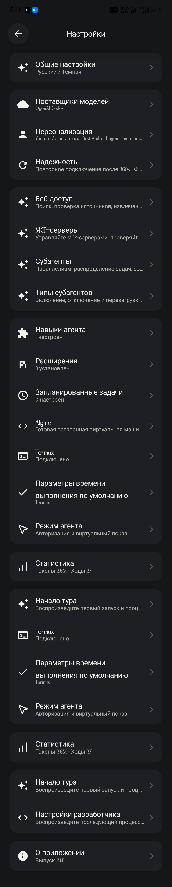
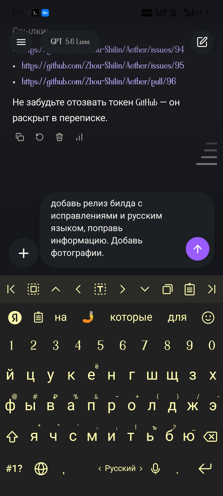

<p align="center">
  
</p>

<h1 align="center">Aether Android RU</h1>

<p align="center"><strong>Русская Android-сборка локального AI-агента Aether</strong></p>

<p align="center">
  <a href="../../releases/latest">Скачать APK</a> ·
  <a href="../../issues">Сообщить об ошибке</a> ·
  <a href="../../pulls">Предложения изменений</a>
</p>

## О проекте

Android-сборка с русским интерфейсом и исправлениями для удобной работы с чатом на мобильном устройстве.

Проект ориентирован на Android и включает локальный AI-агент, расширения, интеграцию с Termux и Alpine-среду.

## Что изменено

- Полная русская локализация Android-интерфейса;
- переведены Web Access, MCP Servers, Subagents и вложенные настройки;
- исправлено схлопывание области чата при открытии экранной клавиатуры;
- сохранена поддержка расширений и Android-интеграций;
- добавлена готовая подписанная debug-сборка APK.

## Скачать

Последний APK доступен на странице [Releases](../../releases/latest).

> Сборка предназначена для тестирования. Перед установкой предыдущей версии может потребоваться удалить конфликтующую подпись APK.

## Скриншоты

<p align="center">
  
  
</p>

## Сборка

```bash
./gradlew :app:assembleDebug --no-daemon --max-workers=1 \
  -Dorg.gradle.jvmargs='-Xmx1024m -Dfile.encoding=UTF-8' \
  -Dkotlin.compiler.execution.strategy=in-process \
  -Paether.versionName=2.1.6
```

APK появится в `app/build/outputs/apk/debug/app-debug.apk`.

## Статус

Текущая версия: **2.1.6 Russian Android**.

Поддерживаются Android 8.0 (API 26) и новее.
